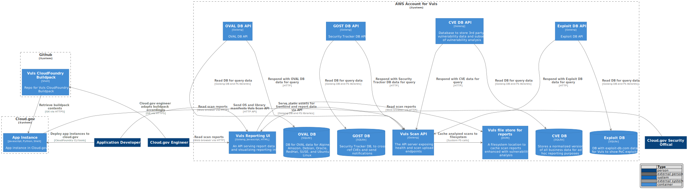
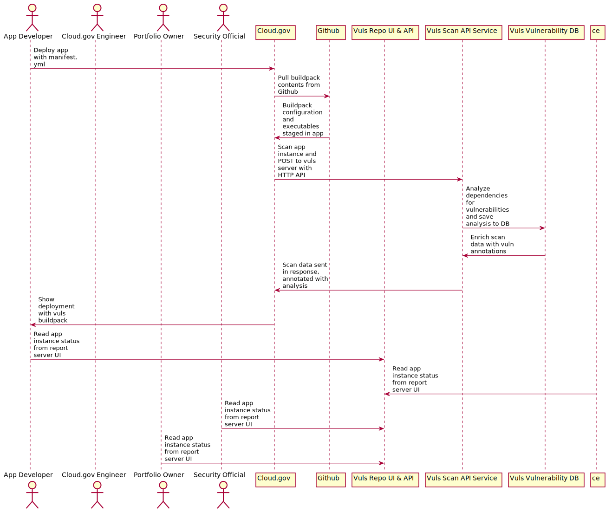

# 10x Dependency Upgrades Evaluation Pipeline Design

## Rationale

## Design

This pipeline leverages CloudFoundry integration points to deploy one or more buildpacks before the final buildpack. The final buildpack finalizes configuration of the application itself and excutes its processes, whereas our use of [a multi-buildpack deployment strategy](https://docs.cloudfoundry.org/buildpacks/use-multiple-buildpacks.html) loads trusted executables and minimal configuration in advance, before these last steps, and will only then trigger a scan once all deployment phases for all subsequent buildpacks is complete.

Similar open source efforts, [vendor integrations](https://blog.aquasec.com/using-aqua-to-secure-applications-on-pivotal-cloud-foundry), and previous [18F research on different approaches for use of Sysdig and Falco](https://youtu.be/wFQOXMcZnQg?t=1485) inspired this approach.

## Architecture

Below is the current system architecture.

(NOTE: This architecture diagram is derived from [updating this PlantUML file](./architecture.puml).)

## Data Flow and Sequence Diagrams

Below is a high-level overview of how scans examine vulnerabilities in an
application's dependencies once deployed into test applications in the cloud.gov
sandbox environment.

(NOTE: This sequence diagram is derived from [updating this PlantUML file](./scan_sequence_diagram.puml).)

## Appendix
